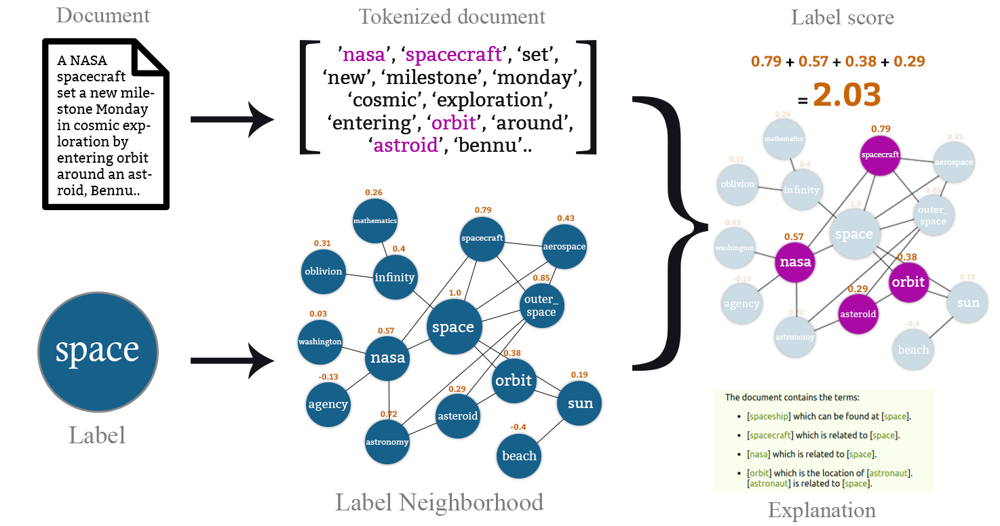

<div align="center"></div>

# Zero-Shot Topic Extraction with Common-Sense Knowledge Graph

This repository contains the code for reproducing the results reported in the paper["Explainable Zero-Shot Topic Extraction with Common-Sense Knowledge Graph" (pdf) https://drops.dagstuhl.de/opus/volltexte/2021/14553/pdf/OASIcs-LDK-2021-17.pdf] ( [LDK 2021 conference](http://2021.ldk-conf.org/)).

A user-friendly demo is available at: http://zeste.tools.eurecom.fr/

## ZeSTE
Based on ConceptNet's common sense knowledge graph and embeddings, ZeSTE generates explainable predictions for a document topical category (e.g. _politics_, _sports_, _video_games_ ..) without reliance on training data. 
The following is a high-level illustration of the approach:

<div align="center"></div>


## API
ZeSTE can also be accessed via a RESTful API for easy deployment and use.
For further information, please refer to the documentation: https://zeste.tools.eurecom.fr/doc

## Dependencies
Before running any code in this repo, please install the following dependencies:
* numpy
* pandas 
* matplotlib
* nltk
* sklearn
* tqdm
* gensim


## Code Overview
This repo is organized as follows:
* `generate_cache.py`: this script processes the raw ConceptNet dump to produce cached files for each node in ConceptNet to accelerate the label neighborhood generation. It also transforms ConceptNet Numberbatch text file into a Gensim word embedding that we pickle for quick loading.
* `zeste.py`: this is the main script for evaluation. It takes as argument the dataset to process as well as model configuration parameters such as neighborhood depth (see below). The results (classification report, confusion matrix, and classification metrics) are persisted into text files.
* `util.py`: contains the functions that are used in `zeste.py`
* `label_mappings`: contains the tab-separated mappings for the studied datasets.

## Reproducing Results
### 1. Downloads
The two following files need to be downloaded to bypass the use of ConceptNet's web API: the dump of ConceptNet triplets, and the ConceptNet Numberbatch pre-computed word embeddings. You can download them from [ConceptNet's](https://github.com/commonsense/conceptnet5/wiki/Downloads) and [Numberbatch's](https://github.com/commonsense/conceptnet-numberbatch) repos, respectively.
```
# wget https://s3.amazonaws.com/conceptnet/downloads/2019/edges/conceptnet-assertions-5.7.0.csv.gz
# wget https://conceptnet.s3.amazonaws.com/downloads/2019/numberbatch/numberbatch-19.08.txt.gz
# gzip -d conceptnet-assertions-5.7.0.csv.gz
# gzip -d numberbatch-19.08.txt.gz
```

### 2. generate_cache.py
This script takes as input the two just-downloaded files and the cache path to where precomputed 1-hop label neighborhoods will be saved. This can take up to 7.2G of storage space.
```
usage: generate_cache.py [-h] [-cnp CONCEPTNET_ASSERTIONS_PATH] [-nbp CONCEPTNET_NUMBERBATCH_PATH] [-zcp ZESTE_CACHE_PATH]

Zero-Shot Topic Extraction

optional arguments:
  -h, --help            show this help message and exit
  -cnp CONCEPTNET_ASSERTIONS_PATH, --conceptnet_assertions_path CONCEPTNET_ASSERTIONS_PATH
                        Path to CSV file containing ConceptNet assertions dump
  -nbp CONCEPTNET_NUMBERBATCH_PATH, --conceptnet_numberbatch_path CONCEPTNET_NUMBERBATCH_PATH
                        Path to W2V file for ConceptNet Numberbatch
  -zcp ZESTE_CACHE_PATH, --zeste_cache_path ZESTE_CACHE_PATH
                        Path to the repository where the generated files will be saved
```


### 3. zeste.py
This script uses the precomputed 1-hop label neighborhoods to recursively generate label neighborhoods of any given depth (`-d`). It takes also as parameters the path to the dataset CSV file (which should have two columns: `text` and `label`). The rest of the arguments are for model experimentation. 

```
usage: zeste.py [-h] [-cp CACHE_PATH] [-pp PREFETCH_PATH] [-nb NUMBERBATCH_PATH] [-dp DATASET_PATH] [-lm LABELS_MAPPING] [-rp RESULTS_PATH]
                [-d DEPTH] [-f FILTER] [-s {simple,compound,depth,harmonized}] [-ar ALLOWED_RELS]

Zero-Shot Topic Extraction

optional arguments:
  -h, --help            show this help message and exit
  -cp CACHE_PATH, --cache_path CACHE_PATH
                        Path to where the 1-hop word neighborhoods are cached
  -pp PREFETCH_PATH, --prefetch_path PREFETCH_PATH
                        Path to where the precomputed n-hop neighborhoods are cached
  -nb NUMBERBATCH_PATH, --numberbatch_path NUMBERBATCH_PATH
                        Path to the pickled Numberbatch
  -dp DATASET_PATH, --dataset_path DATASET_PATH
                        Path to the dataset to process
  -lm LABELS_MAPPING, --labels_mapping LABELS_MAPPING
                        Path to the mapping between the dataset labels and ZeSTE labels (multiword labels are comma-separated)
  -rp RESULTS_PATH, --results_path RESULTS_PATH
                        Path to the directory where to store the results
  -d DEPTH, --depth DEPTH
                        How many hops to generate the neighborhoods
  -f FILTER, --filter FILTER
                        Filtering method: top[N], top[P]%, thresh[T], all
  -s {simple,compound,depth,harmonized}, --similarity {simple,compound,depth,harmonized}
  -ar ALLOWED_RELS, --allowed_rels ALLOWED_RELS
                        Which relationships to use (comma-separated or all)
```
